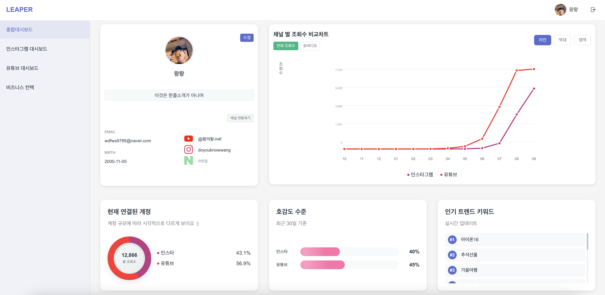
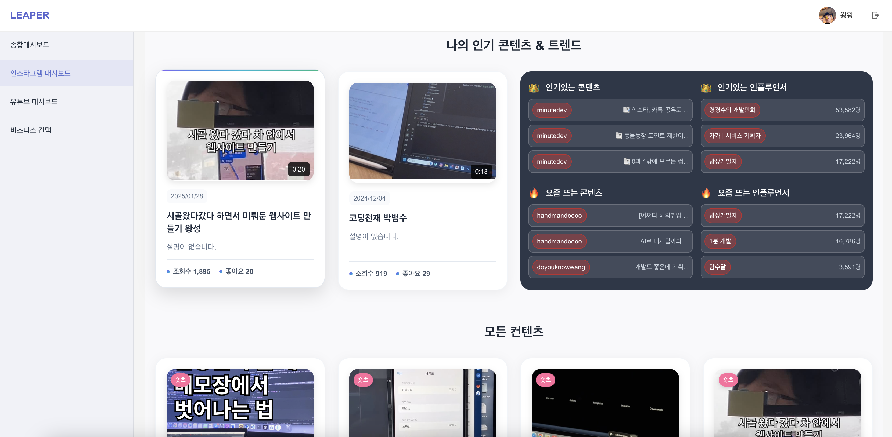
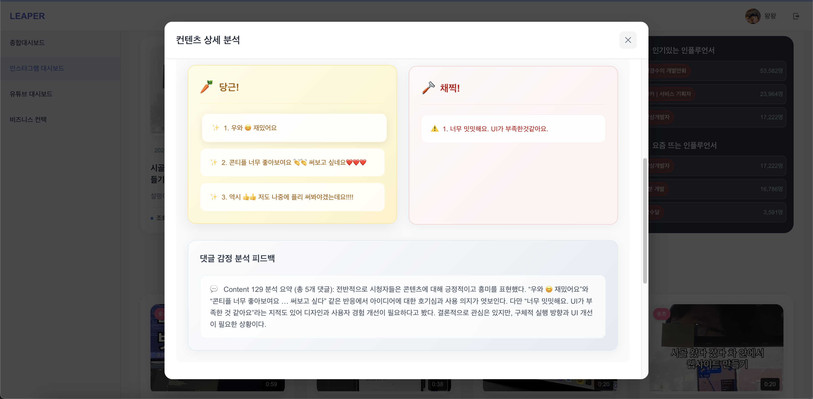
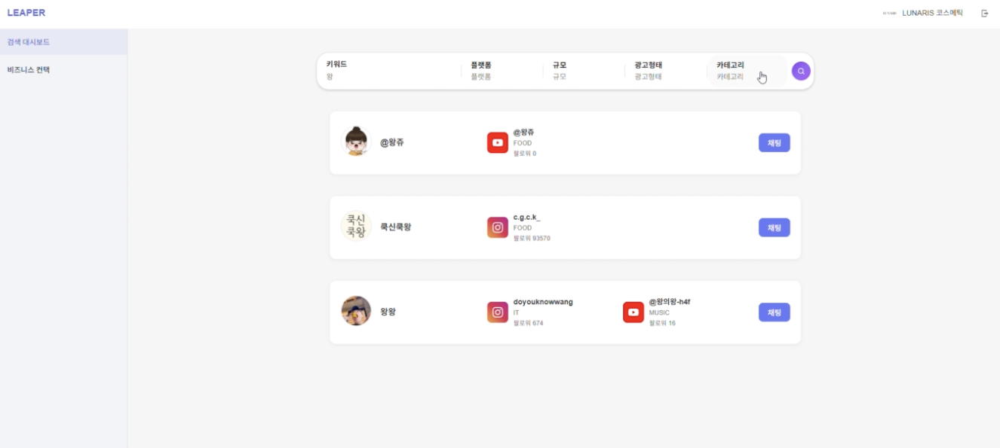
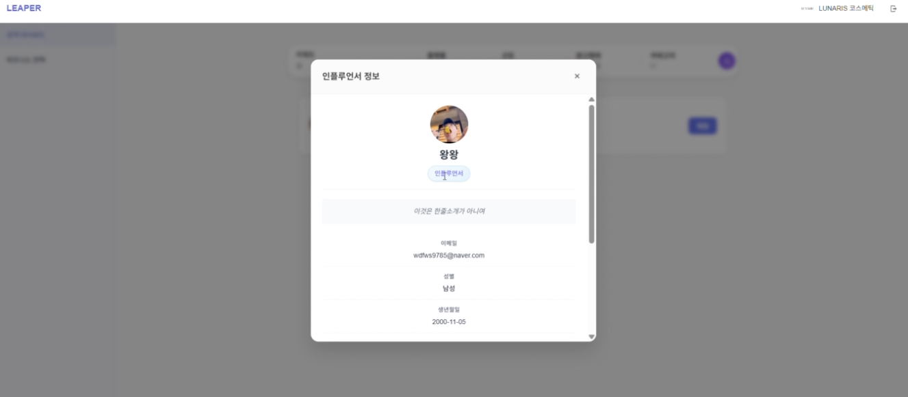
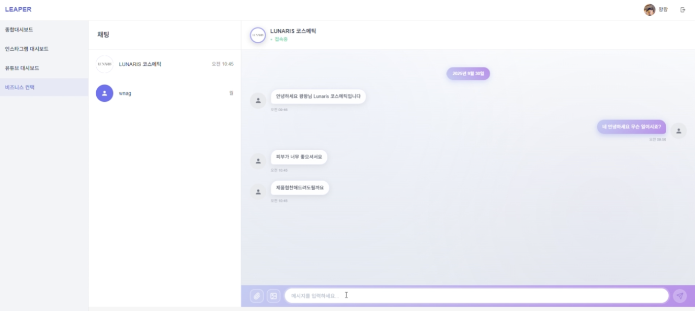
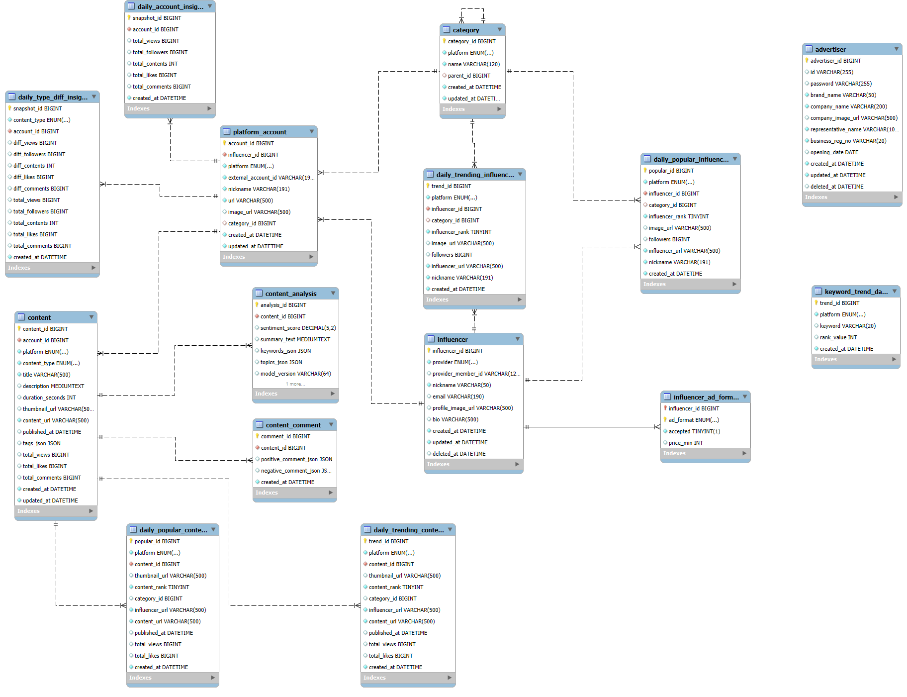

# 🚀 Leaper (리퍼)
> **인플루언서로 도약하고자 하는 사용자를 위한 컨텐츠 분석부터 광고주 매칭까지 지원하는 인플루언서 분석 및 매칭 플랫폼**

Leaper는 인플루언서의 플랫폼별 성과 데이터를 통합 관리하고, AI 기반의 인사이트를 제공하며, 광고주와의 효율적인 협업을 지원하는 종합 플랫폼입니다.

---

## 📅 Project Overview
- **진행 기간**: 2025. 08. 25 ~ 2025. 10. 02 (7주)
- **팀 구성**: 백엔드 3명, 프론트엔드 3명 (총 6명)

---

## 🏗️ System Architecture

본 프로젝트는 서비스의 안정성과 확장성을 위해 멀티 모듈 아키텍처로 구성되어 있습니다.

### 🧩 Backend Modules
- **`leaper` (API 서버)**: 사용자 인증, 대시보드 데이터 제공, 실시간 채팅 등 비즈니스 로직을 담당하는 메인 API 모듈
- **`spark` (데이터 처리)**: 대용량 데이터 수집(Crawling), 분산 처리(Spark), 정기 작업(Batch)을 담당하는 데이터 엔진 모듈

---

## 🛠️ Tech Stack

### 🔹 Backend
- **Framework**: `Spring Boot 3.3.4`, `FastAPI`
- **Data Processing**: `Apache Spark 3.4.3`, `Spring Batch`
- **Language**: `Java 17`, `Java 11`
- **Security**: `Spring Security`, `JWT`, `OAuth2 (Google)`
- **Communication**: `WebSocket`, `SockJS`

### 🔹 Database & Storage
- **Database**: `MySQL` (RDS), `MongoDB`
- **Caching**: `Redis`
- **Storage**: `AWS S3`

### 🔹 Frontend
- **Framework & Language**: `React`, `Typescript`

### 🔹 Infrastructure & DevOps
- **Cloud**: `AWS` (EC2, RDS, S3, Route53, CloudFront)
- **Deployment**: `Jenkins`, `Docker`, `Docker Compose`
- **Web Server**: `Caddy`

---

## ✨ Key Features

### 📊 활동 데이터 분석 (Activity Data Analysis)
- **통합 분석**: 여러 SNS 플랫폼 계정 연동을 통한 조회수, 팔로워, 좋아요 등 주요 지표 통합 관리
- **상세 인사이트**: 플랫폼별·게시물별 성과 분석 및 시각화된 대시보드 제공

  
### 📈 트렌드 분석 (Trend Analysis)
- **인사이트 제공**: 인기 콘텐츠 Top 10, 급상승 키워드, 연관 카테고리 트렌드 등 플랫폼 전체 인사이트 제공
- **AI 분석**: 댓글 감성 분석 및 유사 콘텐츠 비교 분석

 
 

### 🔍 인플루언서 검색 (Influencer Search)
- **맞춤 검색**: 플랫폼, 카테고리, 구독자 규모, 키워드, 콘텐츠 형태 등 다양한 필터링 제공
- **데이터 기반 검증**: 실제 성과 지표를 바탕으로 한 인플루언서 영향력 확인



### 💬 협업 문의 (Collaboration Inquiry)
- **직접 소통**: 서비스 내 실시간 채팅 기능을 통해 광고주가 인플루언서에게 직접 협업 제안 가능
 


---

## 📂 Project Structure

```text
.
├── backend-spring
│   ├── leaper          # Spring Boot 3 & Java 17 (API Server)
│   └── spark           # Spring Boot 2 & Java 11 (Spark/Batch Engine)
├── images              # 프로젝트 리소스 및 다이어그램
└── README.md           # 프로젝트 가이드
```

---

## 🗃️ Database Schema


---

## 👥 Team
-  SSAFY 13기 특화프로젝트 A302 팀


